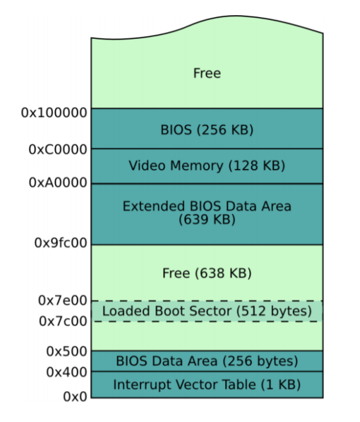

# x86 Crash Course

The assembly I will be describing is `NASM` or the intel schema of x86 assembly as it has better documentation and more closely resembles ARM or LC3 as an assembly language.

### Registers

The best resource for understanding x86 registers is the wiki page on [OSDev](https://wiki.osdev.org/CPU_Registers_x86)

### Some important pseudo-instructions

#### Initialize Data
`DB`, `DW`, `DD`, `DQ`, `DT`, `DDQ`, and `DO` are used to declare/initialized data. Think of these as `.FILL` with various lengths.

| Directive | Purpose            | Space    |
|-----------|--------------------|----------|
| DB        | Define Byte        | 1 bytes  |
| DW        | Define Word        | 2 bytes  |
| DD        | Define Double-word | 4 bytes  |
| DQ        | Define Quad-word   | 8 bytes  |
| DT        | Define Ten Bytes   | 10 bytes |

``` nasm
db      0x55                ; just the byte 0x55
db      0x55,0x56,0x57      ; three bytes in succession
db      'a',0x55            ; we can use character constants
db      'hello',13,10,'$'   ; so are string constants, NOT null terminated
dw      0x1234              ; 0x34 0x12
dw      'a'                 ; 0x41 0x00 (it's just a number)
dw      'ab'                ; 0x41 0x42 (character constant)
dw      'abc'               ; 0x41 0x42 0x43 0x00 (string)
dd      0x12345678          ; 0x78 0x56 0x34 0x12
dq      0x1122334455667788  ; 0x88 0x77 0x66 0x55 0x44 0x33 0x22 0x11
ddq     0x112233445566778899aabbccddeeff00
; 0x00 0xff 0xee 0xdd 0xcc 0xbb 0xaa 0x99
; 0x88 0x77 0x66 0x55 0x44 0x33 0x22 0x11
do      0x112233445566778899aabbccddeeff00 ; same as previous
dd      1.234567e20         ; floating-point constant
dq      1.234567e20         ; double-precision float
dt      1.234567e20         ; extended-precision float
```
#### Uninitialized Data
RESB, RESW, RESD, RESQ, REST, RESDQ, and RESO are designed to be used in the BSS section of a module: they declare uninitialised storage space.
```nasm
resb    64      ; reserve 64 bytes
resw    1       ; reserve a word
resq    10      ; array of ten reals
```


### The most important instructions

The most commonly used instruction will be the `mov` instruction. This is similar to the various `st` instructions of ARM and LC3, however, `mov` can also store immediate values like `and` and `add`.

**Immediate**
```nasm
; x86
mov eax, 14 

; lc3
AND R0, R0, #0
ADD R0, R0, #14
```

**Address**
```nasm
; x86
mov eax, [0x3000] 

; lc3
LEA R0, addr
LDR R1, R0, #0 ; R1 is now  = 0x3000
LDR R2, R1, #0 ; R2 has contents of 0x3000

; or using the LDI instruction is 
LDI R0, addr   ; R0 has contents of 0x3000

addr .FILL 0x3000
```

### Stack
The neat thing about x86 is that there exist special stack instructions that do not need to implemented by the user. If you are fimiliar with ARM of LC3, you know that the user must keep track of the current stack pointer in one of the general purpose registers. The ARM standard has it as `R13`. In x86 the stack is maintain using the `esp`, a register that is specifically meant for holding the stack pointer.

```nasm
mov eax, 14
push eax
call foo    ; this calls the subroutine at label foo where eax is modified
pop eax     ; eax is now back to "14"
```

### Syscall or BIOS interrupt
To print to the screen we can call the bios interrupt. To read more about this, read the [wiki](https://en.wikipedia.org/wiki/INT_10H). 

`int 0x10` - print to screen
`ah <- 0x0e` - scrolling teletype BIOS routine

```nasm
mov ah, 0x0e    ; teletype mode
mov al, 'A'

int 0x10        ; display interrupt
```

### Boot Sector
A boot sector is exactly 512 bytes. If this number sounds is familiar it is because 512 bytes is size of sector on disk. However since the data inside the boot sector will almost never use the full 512 bytes, we will zero pad the data.


- `$` is the assembly position at the beginning of the line containing the expression, so **current address**.

- `$$` is the address of the **beginning of the current section**. About the only thing it's useful for is `$ - $$`, the length of the section so far 

```nasm
; TODO

; $ is the current address, $$ is the start address
times 510 - ($ - $$) db 0 
; we need a magic that tells the computer that the current sector is a boot sector
dw 0xaa55
```

The boot sector needs to start at location 0x7c00. This can be done using using the `org` operator.

```nasm
[org 0x7c00]

; THE CODE

```



### Label
In x86, labels can be used like subroutines just like in LC3. Using `call <label>` is essentially a `jsr <label>`, where the subroutine can be returned using `ret` for both assembly languages.

### Segmenting
All x86 processors start in 16-bit real mode. This means that memory is limited to 16-bits. This is equivalent to LC3's memory space, `0x0000` to `0xFFFF` (64KB). To get around this, we can use segment registers. 

| 16 bit | Description               |
|--------|---------------------------|
| cs     | Code segment              |
| ds     | Data segment              |
| es     | Extra segment             |
| ss     | Stack segment             |
| fs     | General purpose f segment |
| gs     | General purpose g segment |

We can set the segments to a specific value, and the segment registers will act like an address buffer.

We can set the segment registers by moving the value of a general purpose register (in this case `ax`) into one of the segment registers.
```nasm
push ax
mov ax 0x3000    ; the extra segment will start with offset 0x3000
mov es, ax
pop ax

mov ax, [0x1234] ; the address will be 0x1234 buffered with 0x3000
                 ; or contents of 0x4234
```

### Read From Drive
Similar to calling the bios interrupt for printing to the screen, we need to setup the certain values to certain registers before calling the interrupt. We are specifically trying to read sectors from the drive.

| Registers | Parameters             |
|-----------|------------------------|
| ah        | 0x02                   |
| al        | Sectors to Read Count  |
| ch        | Cylinder               |
| cl        | Sector                 |
| dh        | Head                   |
| dl        | Drive                  |
| es:bx     | Buffer Address Pointer |

This will return

| Registers  | Return Val                  |
|------------|-----------------------------|
| cf (carry) | Set on Error, else No Error |
| ah         | Return Code                 |
| al         | Actual Sectors Read Count   |

We want to:
1. Set `ah` to `0x02`
2. Set `dl` to the type of drive to be read
   - `0x80` represents a hard drive
   - `0x00` represents a floppy/cd. Note that a usb drive with an iso emulates a floppy.
3. Set `ch`, `df`, `al`, and `cl`.
   -  Note that the boot sector is sector `0x01` and has already been read into memory (it is 1-indexed).
4. The `es:bx` indicates where the disk information will be in memory. The default space for the boot sector is `0x7c00` and we want to move it 512 B (size of a sector) after. 


### Separating functions
Similar to `c`'s `#include`, we can used `%include <file path>` to separate the functions into different files. Unlike `c` where there are seperate object files, the `%include` acts as a text replacement where the contents of the included file will essentially be copied in place of the `%include`. We can confirm this as the final `.bin` file has the assembled values of the include files at the specified location.


### The kernel
There are 3 sections to a kernel. The data or `.data`, variables or `.bss`, and code or `.text`.

Note that the `.data` and `.bss` will be placed after the `.text` section and subsequently the magic value of the boot loader code.

#### Bits directive
```nasm
[bits <mode>]        ; either 16, 32, or 64
```
#### .data
This section hold constants.
```nasm
section .data
   ; your constants
   DAY_IN_YEAR: equ 365
```

#### .bss
This section hold variables.
```nasm
section .bss
   ; your mutable variables
   BUFFER:
      resb 4096         ; buffer of size 4096 bytes
```

#### .text
This section hold code.
```nasm
section .text
   ; entry point to the code
   global main ; the entry point is main label

   ; the code
   main:
      hlt
```

#### Some initializations
1. Clearing segment registers
2. Moving the stack pointer (esp) to the entry point.

### Direction Flag
The direction flag indicates the direction that certain *string instructions* are incremented. `MOVS` is a string copy, `CMPS` is a string compare, etc. However, since strings occupy variable length and are null terminated, the read is done using pointer arithmetic. When the direction flag is 0, the instructions work by incrementing the pointer to the address after, while if the flag is 1, the pointer is decremented.

#### Making sure the Disk is properly set
Sometimes the disk will have its head or track or cylinder set to a different value that is not 0. To make sure that this is fixed during start up, we will call `int 0x13` or read disk to properly set the disk.

### A20
In older intel microprocessors like the 8086 and 8088, the address bus has 20 bits where A19 is MSB and A0 is LSB. This allows for `2^20` bytes if data or 1 Mebibyte. However since the 8086 and 8088 are 16-bits machines, the microprocessor could not reach address past `0xFFFF`. To overcome this, the processors uses segmenting.

The processor used a segment address and offset address such that the memory access was:
```nasm
<segment addr> + <offset addr> = <actual address>

((0x0000) << 4) + 0x3000 = 0x03000
((0xF000) << 4) + 0x3000 = 0xF3000
```

However the problem of overflow occurs. If the address exceeds 20 bits, the address would be truncated. Take the example:
```nasm
((0xF800) << 4) + 0x8000 = 0x100000 ; where the truncated address is 0x00000
```

This wrapping can be used to index to any point in memory